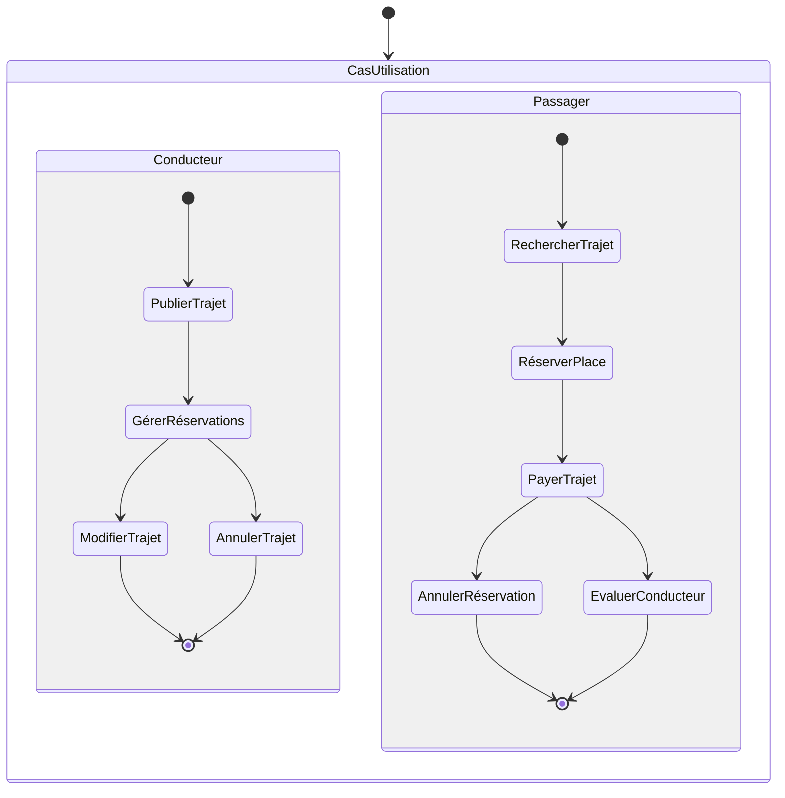
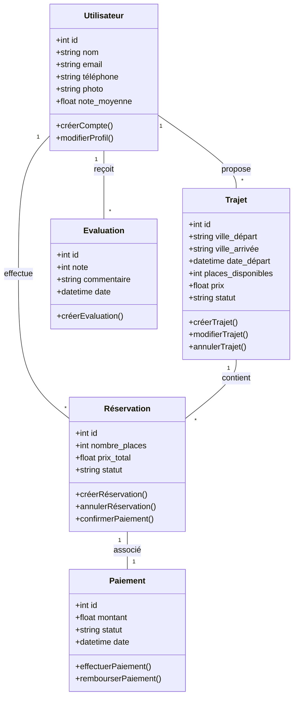

## Diagramme de Cas d'Utilisation

```mermaid
stateDiagram-v2
    [*] --> CasUtilisation
    state CasUtilisation {
        state "Conducteur" as C {
            [*] --> PublierTrajet
            PublierTrajet --> GérerRéservations
            GérerRéservations --> ModifierTrajet
            GérerRéservations --> AnnulerTrajet
            ModifierTrajet --> [*]
            AnnulerTrajet --> [*]
        }
        state "Passager" as P {
            [*] --> RechercherTrajet
            RechercherTrajet --> RéserverPlace
            RéserverPlace --> PayerTrajet
            PayerTrajet --> AnnulerRéservation
            PayerTrajet --> EvaluerConducteur
            AnnulerRéservation --> [*]
            EvaluerConducteur --> [*]
        }
    }
```

## Diagramme de Classes

```mermaid
classDiagram
    class Utilisateur {
        +int id
        +string nom
        +string email
        +string téléphone
        +string photo
        +float note_moyenne
        +créerCompte()
        +modifierProfil()
    }
    class Trajet {
        +int id
        +string ville_départ
        +string ville_arrivée
        +datetime date_départ
        +int places_disponibles
        +float prix
        +string statut
        +créerTrajet()
        +modifierTrajet()
        +annulerTrajet()
    }
    class Réservation {
        +int id
        +int nombre_places
        +float prix_total
        +string statut
        +créerRéservation()
        +annulerRéservation()
        +confirmerPaiement()
    }
    class Evaluation {
        +int id
        +int note
        +string commentaire
        +datetime date
        +créerEvaluation()
    }
    class Paiement {
        +int id
        +float montant
        +string statut
        +datetime date
        +effectuerPaiement()
        +rembourserPaiement()
    }
    
    Utilisateur "1" -- "*" Trajet : propose
    Utilisateur "1" -- "*" Réservation : effectue
    Trajet "1" -- "*" Réservation : contient
    Utilisateur "1" -- "*" Evaluation : reçoit
    Réservation "1" -- "1" Paiement : associé
```
